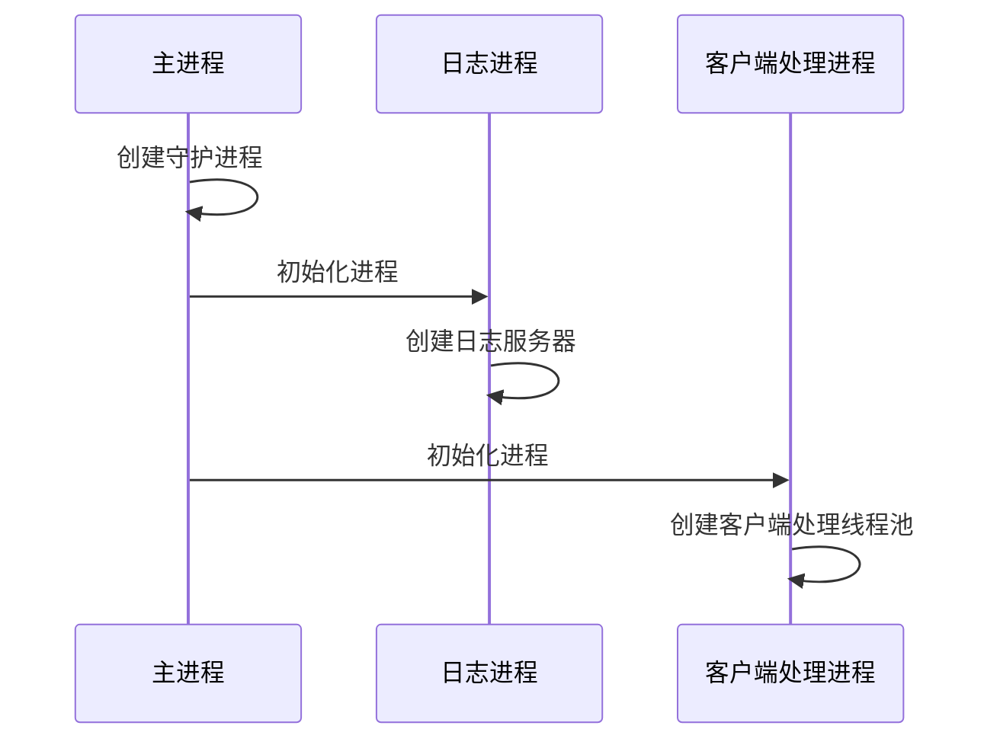
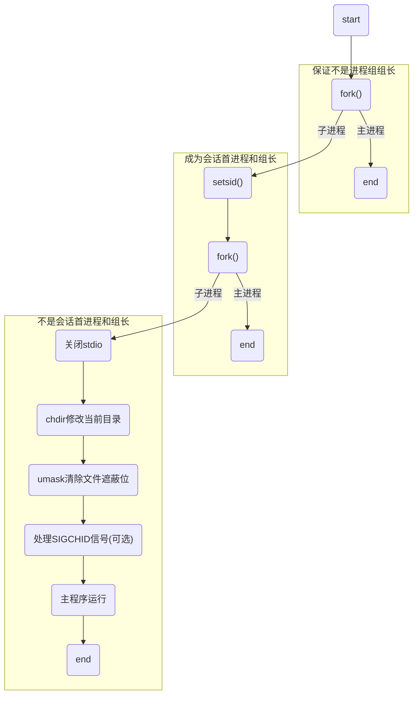

# Playback Node Learning Documents

## 进程时序图




## fd的进程间发送

```c++
// 核心
cmsg->cmsg_level = SOL_SOCKET;
cmsg->cmsg_type = SCM_RIGHTS;
*((int*) CMSG_DATA(cmsg)) = fd;
// 告诉内核要通过 socket 发送一个控制信息，这个控制信息的类型是 SCM_RIGHTS，希望共享当前进程里 fd 表里的这个文件描述符
```


```c++
/*
* 通过管道以及 msghdr 和 cmsghdr 来发送
*/

// read fd
int ReadFromPipe(int& fd) {
    struct msghdr msg;
    struct iovec iov[2];
    char temp[2][10];
    iov[0].iov_len = sizeof(temp[0]);
    iov[0].iov_base = temp[0];
    iov[1].iov_len = sizeof(temp[1]);
    iov[1].iov_base = temp[1];
    msg.msg_iov = iov;
    msg.msg_iovlen = 2;

    char cmsg_buf[CMSG_SPACE(sizeof(int))];
    msg.msg_control = cmsg_buf;
    msg.msg_controllen = sizeof(cmsg_buf);

    if (-1 == recvmsg(pipe_[0], &msg, 0)) {
        printf("<%s> : <%d> : err(%s)\n", __FUNCTION__, __LINE__, strerror(errno));
        return -1;
    }
    struct cmsghdr* cmsg = CMSG_FIRSTHDR(&msg);
    if (cmsg &&
        cmsg->cmsg_level == SOL_SOCKET &&
        cmsg->cmsg_type == SCM_RIGHTS)
    {
        memcpy(&fd, CMSG_DATA(cmsg), sizeof(fd));
        return 0;
    }
    printf("<%s> : <%d> : err(%s)\n", __FUNCTION__, __LINE__, strerror(errno));
    return -1;
}

// send fd
int WriteToPipe(int fd) {
    struct msghdr msg = {};	// note: 必须清零(因为msg_name相关成员没有用到,即没有初始化),sendmsg会Bad address error
    struct iovec iov[2];
    char temp[2][10] = {"wang", "shuo"};
    iov[0].iov_base = temp[0];
    iov[0].iov_len = strlen(temp[0]) + 1;
    iov[1].iov_base = temp[1];
    iov[1].iov_len = strlen(temp[1]) + 1;
    msg.msg_iov = iov;
    msg.msg_iovlen = 2;

    char cmsg_buf[CMSG_SPACE(sizeof(int))];
    msg.msg_control = cmsg_buf;
    msg.msg_controllen = sizeof(cmsg_buf);

    struct cmsghdr* cmsg = CMSG_FIRSTHDR(&msg);
    cmsg->cmsg_len = CMSG_LEN(sizeof(int));
    cmsg->cmsg_level = SOL_SOCKET;
    cmsg->cmsg_type = SCM_RIGHTS;

    void* cdata = CMSG_DATA(cmsg); 
    *static_cast<int*>(cdata) = fd;

    if (-1 == sendmsg(pipe_[1], &msg, 0)) {
        printf("<%s> : <%d> : err(%s)\n", __FUNCTION__, __LINE__, strerror(errno));
        return -1;
    }
    return 0;
}

```


## 守护进程创建




```c++
int Daemonize() {
    pid_t pid = fork();
    if (pid == -1) {return -1;}
    if (pid > 0) { exit(0); }

    if (-1 == setsid()) {return -2;}
    pid = fork();
    if (pid == -1) {return -3;}
    if (pid > 0) { exit(0); }
	
    // 忽略 SIGCHLD，防止子进程变僵尸
    signal(SIGCHLD, SIG_IGN);
    
    // 修改工作目录
    chdir("/"); 

    // 重设文件权限掩码
    umask(0);

    // 关闭标准输入输出
    close(STDIN_FILENO);
    close(STDOUT_FILENO);
    close(STDERR_FILENO);

    // 重定向到 /dev/null
    open("/dev/null", O_RDONLY);  // stdin
    open("/dev/null", O_WRONLY);  // stdout
    open("/dev/null", O_RDWR);    // stderr

    return 0;
}
```


**`chdir("/")` — 切换工作目录为根目录**

```c++
chdir("/");
```

- 防止守护进程**阻止文件系统被卸载**。
- 守护进程可能会在后台长时间运行，如果当前目录仍是某个挂载的文件系统（例如 `/mnt/data`），则该挂载点在卸载时会失败。
- `chdir("/")` 将当前目录切换到根目录 `/`，几乎不可能被卸载。


 **`umask(0)` — 清除默认文件权限掩码**

```c++
umask(0);
```

- **umask** 是一个默认的权限掩码，它影响用 `open`、`creat`、`mkdir` 等系统调用新建文件的权限。
- 默认情况下它可能是 `022`，意味着默认去掉了“组”和“其他人”的写权限。
- 守护进程中我们往往希望**完全控制文件权限**，所以将其设置为 `0`，表示不限制任何权限，交由程序显式决定。


**关闭标准输入、输出、错误输出文件描述符**

```c++
close(STDIN_FILENO);   // 关闭标准输入（0）
close(STDOUT_FILENO);  // 关闭标准输出（1）
close(STDERR_FILENO);  // 关闭标准错误（2）
```

- 守护进程通常是**后台运行的，不依赖终端**。
- 如果不关闭它们：
	- 守护进程可能仍然绑定到控制终端；
	- 误操作可能导致输出打到终端上；
	- 如果终端关闭，进程可能接收到 `SIGHUP`（挂起信号）。
- 所以，**必须关闭标准 IO 描述符**（文件描述符 0、1、2）。


**重定向标准输入、输出和错误输出到 `/dev/null`**

```c++
open("/dev/null", O_RDONLY);  // stdin (fd 0)
open("/dev/null", O_WRONLY);  // stdout (fd 1)
open("/dev/null", O_RDWR);    // stderr (fd 2)
```

- 上面三行代码的作用是**重新打开文件描述符 0、1、2**，指向 `/dev/null`，这样程序中若有代码误用 `printf` 或 `read(stdin)`，也不会导致错误或打印到不可预期的位置。
- `/dev/null` 是一个**特殊的设备文件**：
	- 读它总是返回 EOF；
	- 写它会直接被丢弃。

